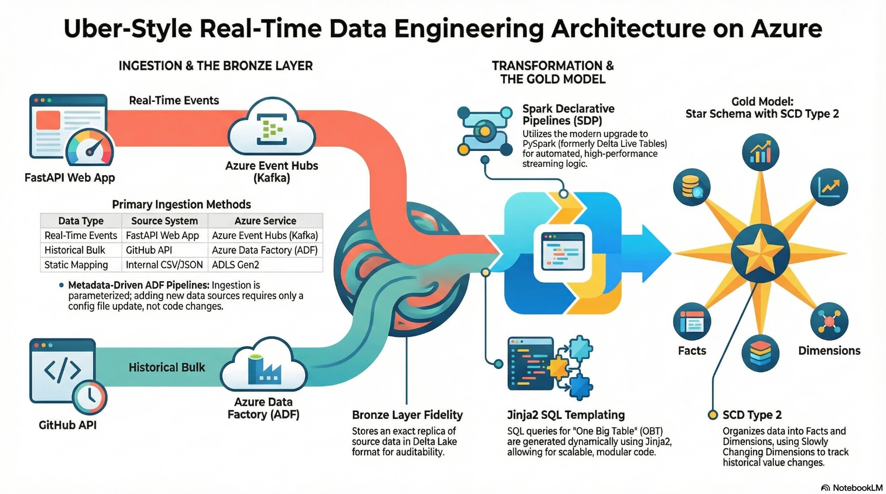

<div align="center">

# 🚗 Real-Time Uber Analytics
### A Medallion Data Engineering Pipeline on Azure & Databricks

<br/>

**An end-to-end streaming data pipeline that simulates Uber ride confirmations in real time, ingests events through Azure Event Hubs (Managed Kafka), processes them through a Medallion Architecture in Databricks, and delivers a production-ready Star Schema for analytics.**

<br/>

[](https://azure.microsoft.com/)
[](https://www.databricks.com/)
[](https://spark.apache.org/)
[](https://kafka.apache.org/)
[](https://www.python.org/)
[](https://fastapi.tiangolo.com/)
[](https://delta.io/)
[](https://jinja.palletsprojects.com/)

<br/>


</div>

---

## 📌 Table of Contents

- [Architecture](#-architecture)
- [Tech Stack](#%EF%B8%8F-tech-stack)
- [Pipeline Deep Dive](#-pipeline-deep-dive)
  - [Phase 1 — Real-Time Data Generation & Event Hubs](#phase-1--real-time-data-generation--event-hubs)
  - [Phase 2 — Batch Ingestion via Azure Data Factory](#phase-2--batch-ingestion-via-azure-data-factory)
  - [Phase 3 — Bronze Layer & Databricks Setup](#phase-3--bronze-layer--databricks-setup)
  - [Phase 4 — Silver Layer & One Big Table](#phase-4--silver-layer--one-big-table)
  - [Phase 5 — Gold Layer (Star Schema & SCDs)](#phase-5--gold-layer-star-schema--scds)
  - [Phase 6 — Orchestration](#phase-6--orchestration)
- [Key Engineering Decisions](#-key-engineering-decisions)
- [Getting Started](#-getting-started)
- [Project Structure](#-project-structure)

---

## 🏗 Architecture

<div align="center">

</div>

<br/>

> **Two ingestion paths converge into a unified Medallion Lakehouse.** A FastAPI web app pushes real-time ride events to Azure Event Hubs (Managed Kafka), while Azure Data Factory pulls historical bulk data and static reference files from GitHub. Both streams land in ADLS Gen2, flow through **Bronze → Silver → Gold** layers in Databricks using Spark Declarative Pipelines, and produce a fully dimensional **Star Schema** with SCD Type 2 — ready for BI, reporting, and analytics.

<br/>

<table>
<tr>
<td width="33%">

### 🟢 Ingestion & Bronze Layer

| Data Type | Source System | Azure Service |
|:---|:---|:---|
| Real-Time Events | FastAPI Web App | Azure Event Hubs (Kafka) |
| Historical Bulk | GitHub API | Azure Data Factory (ADF) |
| Static Mapping | Internal CSV/JSON | ADLS Gen2 |

The initial landing zone where exact replicas of source data are stored in Delta Lake format, maintaining full data fidelity before any transformation occurs.

</td>
<td width="33%">

### 🟡 Silver Layer & OBT

| Component | Technology |
|:---|:---|
| Stream Processing | Spark Declarative Pipelines (SDP) |
| SQL Generation | Jinja2 Templating |
| Late Data Handling | 3-min Watermark |

Real-time streams from Event Hubs are unified with historical bulk data into a single, comprehensive "Silver" staging table using dynamic Jinja2 SQL joins.

</td>
<td width="33%">

### 🟠 Gold Layer — Dimensional Modeling

| Table | Type |
|:---|:---|
| fact_rides | Fact — Measures |
| dim_passenger | SCD Type 1 |
| dim_driver | SCD Type 1 |
| dim_payment | SCD Type 1 |
| dim_vehicle | SCD Type 1 |
| dim_booking | SCD Type 1 |
| dim_location | **SCD Type 2** |

The final model is optimized for BI, ensuring that join conditions (like filtering for non-expired records) provide accurate, non-duplicated insights.

</td>
</tr>
</table>

---

## ⚙️ Tech Stack

| Layer | Technology | Purpose |
|:---|:---|:---|
| **Generation** | FastAPI (Python) | Real-time ride simulation |
| **Streaming** | Azure Event Hubs (Kafka) | Pub/Sub message broker |
| **Batch** | Azure Data Factory (ADF) | Metadata-driven ingestion |
| **Storage** | ADLS Gen2 + Delta Lake | Centralized lakehouse |
| **Compute** | Databricks + PySpark | Distributed transformations |
| **Framework** | Spark Declarative Pipelines | Orchestration & lineage |
| **Templating** | Jinja2 | Dynamic SQL generation |
| **Pattern** | Medallion (Bronze/Silver/Gold) | Progressive data enrichment |
| **Modeling** | Star Schema + SCD Type 1 & 2 | Dimensional model with CDC |

---

## 🔬 Pipeline Deep Dive

### Phase 1 — Real-Time Data Generation & Event Hubs

- **Azure Event Hubs** operates as a managed Apache Kafka instance on the **Standard Pricing Tier** (required to enable Kafka topics).
- **Shared Access Policies** enforce security — a dedicated **Send** policy authorizes the FastAPI producer, while a **Listen** policy authorizes the Databricks consumer.
- A **FastAPI web application** simulates a ride-booking service: each booking generates a batch of simulated JSON events published instantly to Azure Event Hubs via a Pub/Sub model.

---

### Phase 2 — Batch Ingestion via Azure Data Factory

- Azure Data Factory orchestrates the migration of historical "Bulk Rides" and static mapping files (Cities, Payment Methods) from GitHub to ADLS Gen2.
- Built as a **metadata-driven pipeline** — a `files_array.json` config drives a Lookup → ForEach → Copy Data chain, eliminating hardcoded paths and making the pipeline fully extensible.

---

### Phase 3 — Bronze Layer & Databricks Setup

- **The Bronze Layer** is the initial landing zone where exact replicas of source data are stored in Delta Lake format, maintaining full data fidelity before any transformation occurs.
- **ADLS Gen2 Integration** via SAS tokens — JSON mapping files read through Pandas, then converted to Spark DataFrames.
- **Spark Declarative Pipelines (SDP)** utilize the modern Spark 4.1 framework (formerly DLT) to automate orchestration, state management, and incremental streaming processing.

---

### Phase 4 — Silver Layer & One Big Table

- **Data Normalization** — PySpark `from_json()` with a defined schema converts raw binary strings into proper tabular columns.
- **Append Flow** — `dp.append_flow` safely unions the initial bulk load with continuous streaming data, preventing reprocessing of historical data.
- **Jinja2 Templating** — Joins are automated using Jinja2 SQL templating, allowing for a modular architecture where new tables can be added via config files without breaking the core code.
- **Streaming Watermarks** — The `STREAM` keyword with a `WATERMARK` (3-minute delay) on `booking_timestamp` handles late-arriving data in stateful streaming transformations.

<details>
<summary><b>🔍 Click to expand — Jinja2 Templating Example</b></summary>

```python
# Python configuration dictionary
join_config = {
    "dim_city":     {"key": "city_id"},
    "dim_vehicle":  {"key": "vehicle_type_id"},
    "dim_payment":  {"key": "payment_method_id"},
}
```

```sql
-- Jinja2 dynamically generates:
SELECT s.*, 

  {{ table }}.*,

FROM streaming_table s

LEFT JOIN {{ table }} ON s.{{ config.key }} = {{ table }}.{{ config.key }}

```

</details>

---

### Phase 5 — Gold Layer (Star Schema & SCDs)

The Silver OBT is split into **6 Dimension** tables and **1 Fact** table using `dp.create_autocdc_flow`.

- **SCD Type 1** (Overwrite) — used for Passengers, Drivers, Vehicles, Payments, and Bookings.
- **SCD Type 2** (Historical Tracking) — implemented on `dim_location`. Unlike static Type 1 updates, Type 2 tracks historical changes (e.g., "Los Angeles" becoming "Las Vegas") using `start_at` / `end_at` timestamps to maintain record history.
- **fact_rides** stores quantitative metrics: distance, duration, and various fare components.

**⚠️ Critical Join Rule** — Fact-to-SCD2 joins require `WHERE dim_location.end_at IS NULL` to prevent row multiplication from expired historical records.

---

### Phase 6 — Orchestration

A **Databricks Job** unifies all pipeline stages into a single scheduled workflow with dependency chaining across Bronze → Silver → Gold.

---

## 🧠 Key Engineering Decisions

| # | Decision | Rationale |
|:---:|:---|:---|
| 1 | **Event Hubs over raw Kafka** | Fully managed, native Azure integration, eliminates cluster ops overhead |
| 2 | **Metadata-driven ADF pipeline** | Single pipeline handles N files — add a new source by editing JSON, not code |
| 3 | **`dp.append_flow` for union** | Prevents reprocessing the bulk historical load on every micro-batch |
| 4 | **Jinja2 for SQL generation** | Decouples join logic from table definitions — schema changes don't break SQL |
| 5 | **Watermarking (3 min)** | Balances data freshness with tolerance for late-arriving streaming events |
| 6 | **SCD Type 2 on Location** | Preserves geographic change history critical for ride analytics over time |
| 7 | **`end_at IS NULL` join filter** | Mandatory guard against Cartesian explosion when joining Facts to SCD2 dims |
| 8 | **SAS tokens for ADLS access** | Granular, time-bound authentication without exposing storage account keys |

---

## 🚀 Getting Started

### Prerequisites

| Requirement | Details |
|:---|:---|
| **Azure Subscription** | Event Hubs (Standard tier), ADLS Gen2, Data Factory |
| **Databricks Workspace** | Free or Standard edition with SDP/DLT support |
| **Python 3.9+** | FastAPI, azure-eventhub, Jinja2, PySpark |

### Quick Start

```bash
# 1️⃣  Clone the repository
git clone https://github.com/anshlambagit/Uber_Data_Engineer_Project.git
cd Uber_Data_Engineer_Project

# 2️⃣  Install Python dependencies
pip install -r requirements.txt

# 3️⃣  Configure Azure credentials
#     → Set Event Hub connection strings (Send & Listen policies)
#     → Set ADLS Gen2 SAS tokens
#     → Update Databricks secrets / configs

# 4️⃣  Run the FastAPI data generator
uvicorn app:app --reload

# 5️⃣  Deploy ADF pipeline
#     → Import the pipeline JSON into your Azure Data Factory instance
#     → Trigger the initial batch load

# 6️⃣  Deploy Databricks notebooks
#     → Import notebooks into your Databricks workspace
#     → Configure the SDP pipeline and schedule the Databricks Job
```

---

## 📂 Project Structure

```
Uber_Data_Engineer_Project/
│
├── 📄 README.md
├── 🖼️ architecture_detailed.png        # Architecture diagram
│
├── 🐍 fastapi_app/                     # Real-time data generator
│   ├── app.py                          # FastAPI application entry point
│   └── data_generator.py              # Ride data simulation logic
│
├── 🏭 adf_pipeline/                    # Azure Data Factory configs
│   └── files_array.json               # Metadata-driven file list
│
├── 📓 databricks_notebooks/            # Databricks processing notebooks
│   ├── bronze_layer.py                # Raw ingestion & Event Hubs consumer
│   ├── silver_layer.py                # Jinja-templated joins & OBT
│   ├── gold_layer.py                  # Star schema & SCD processing
│   └── jinja_templates/               # Dynamic SQL templates
│
└── ⚙️ config/                          # Connection strings & configurations
```

> **Note:** Adjust the directory structure above to match the actual layout of your repository.

---

<div align="center">

*Built with* &nbsp;  &nbsp;  &nbsp;  &nbsp;  &nbsp; 

</div>
